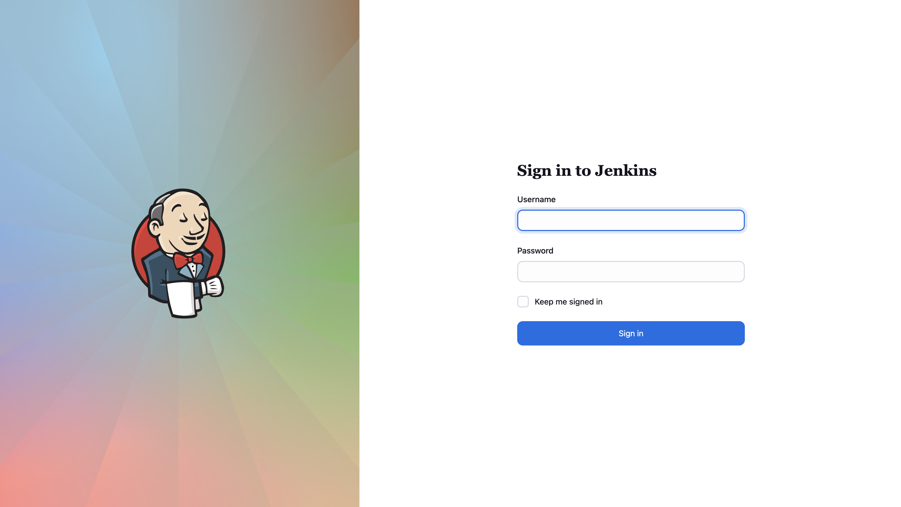
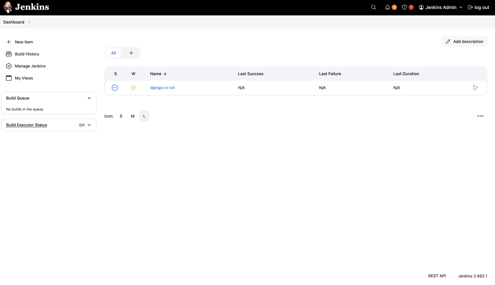
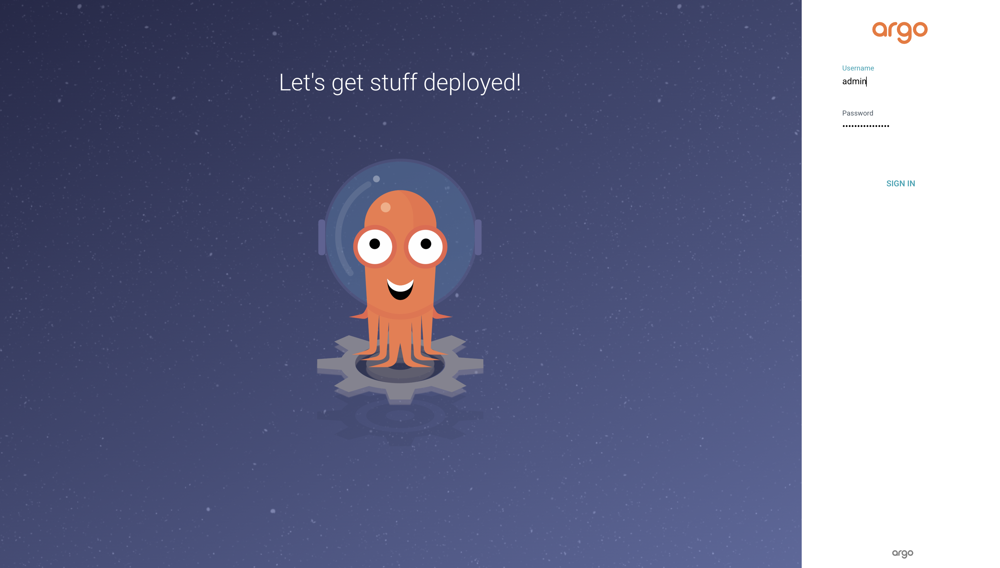
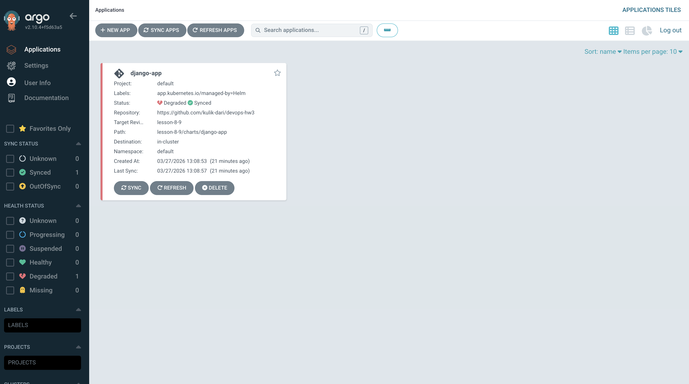
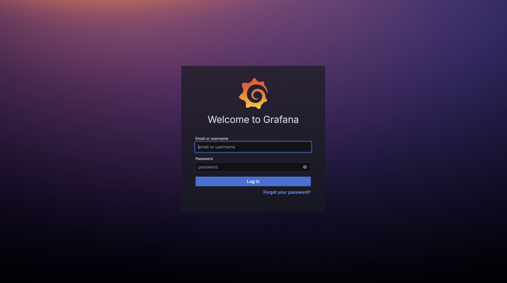

# Final Project — DevOps Infrastructure on AWS

**Автор:** Дарія Куликова  
**Репозиторій:** https://github.com/kulik-dari/devops-hw3  
**Гілка:** `final-project`

---

## Результати розгортання

| Компонент | Статус | Деталі |
|-----------|--------|--------|
| EKS Cluster | ✅ Running | `final-eks`, 2 ноди t3.medium |
| VPC | ✅ Active | `vpc-00b26597f26ccd886`, 3 AZ |
| ECR | ✅ Ready | `746764748053.dkr.ecr.us-west-2.amazonaws.com/final-django` |
| RDS PostgreSQL | ✅ Available | `final-postgres.c7ugwg6iezn5.us-west-2.rds.amazonaws.com:5432` |
| Jenkins 2.492.1 | ✅ Running | LoadBalancer, job django-ci-cd |
| ArgoCD v2.10 | ✅ Running | django-app Synced |
| Prometheus | ✅ Running | kube-prometheus-stack |
| Grafana | ✅ Running | LoadBalancer |
| HPA | ✅ Configured | 2-6 подів при CPU > 70% |

---

## Архітектура CI/CD

```
┌─────────────┐    git push     ┌─────────────┐
│  Developer  │────────────────▶│   GitHub    │
└─────────────┘                 └──────┬──────┘
                                       │ webhook/poll
                                       ▼
                                ┌─────────────┐
                                │   Jenkins   │ ← Helm + Terraform
                                │  (на EKS)   │ ← Kaniko agent
                                └──────┬──────┘
                                       │
                        ┌──────────────┼──────────────┐
                        ▼              ▼               ▼
                 Build Docker    Push to ECR    Update values.yaml
                 (Kaniko pod)    (AWS ECR)      + git push
                                                       │
                                               git change detected
                                                       ▼
                                ┌─────────────┐
                                │   ArgoCD    │ ← Helm + Terraform
                                │  (на EKS)   │ ← auto-sync
                                └──────┬──────┘
                                       │ синхронізація
                                       ▼
                                ┌─────────────┐
                                │  Django App │ ← Helm chart
                                │  + HPA      │ ← підключений до RDS
                                └──────┬──────┘
                                       │
                        ┌──────────────┴──────────────┐
                        ▼                             ▼
                 ┌─────────────┐             ┌──────────────┐
                 │     RDS     │             │  Prometheus  │
                 │ PostgreSQL  │             │  + Grafana   │
                 └─────────────┘             └──────────────┘
```

---

## Структура проєкту

```
final-project/
├── main.tf                     # Всі 7 модулів Terraform
├── backend.tf                  # S3 + DynamoDB remote backend
├── outputs.tf                  # URLs Jenkins, ArgoCD, Grafana, RDS
├── .gitignore
├── README.md
├── screenshots/                # Скріншоти роботи всіх сервісів
│
├── modules/
│   ├── s3-backend/             # S3 бакет + DynamoDB для Terraform state
│   ├── vpc/                    # VPC, публічні/приватні підмережі, NAT GW
│   ├── ecr/                    # ECR репозиторій для Django образу
│   ├── eks/                    # EKS 1.29 + Node Group + OIDC + EBS CSI
│   ├── rds/                    # RDS PostgreSQL (shared/rds/aurora)
│   ├── jenkins/                # Jenkins через Helm + JCasC + job-dsl
│   ├── argo_cd/                # ArgoCD через Helm + Application CR
│   └── monitoring/             # kube-prometheus-stack
│
├── charts/
│   └── django-app/             # Helm chart (watched by ArgoCD)
│       ├── Chart.yaml
│       ├── values.yaml         ← Jenkins оновлює image.tag тут
│       └── templates/
│           ├── deployment.yaml
│           ├── service.yaml
│           ├── configmap.yaml
│           └── hpa.yaml
│
└── Django/
    ├── Dockerfile
    ├── Jenkinsfile              # CI/CD pipeline: build → ECR → git push
    └── docker-compose.yaml     # Локальна розробка з PostgreSQL
```

---

## Скріншоти роботи

### Jenkins — сторінка входу


### Jenkins — Dashboard: pipeline django-ci-cd створено автоматично через JCasC


### ArgoCD — сторінка входу


### ArgoCD — Application django-app: Synced ✅


### Grafana — сторінка входу


### Grafana — Dashboard: моніторинг кластера


---

## Порядок розгортання

### Передумови

```bash
brew install terraform awscli helm kubectl
aws configure  # region: us-west-2
```

### Крок 1 — S3 Backend

```bash
cd final-project
terraform init
terraform apply -target=module.s3_backend
```

### Крок 2 — Увімкнути remote backend

```bash
sed -i '' 's/# terraform {/terraform {/' backend.tf
sed -i '' 's/#   backend "s3" {/  backend "s3" {/' backend.tf
sed -i '' 's/#     bucket/    bucket/' backend.tf
sed -i '' 's/#     key/    key/' backend.tf
sed -i '' 's/#     region/    region/' backend.tf
sed -i '' 's/#     dynamodb_table/    dynamodb_table/' backend.tf
sed -i '' 's/#     encrypt/    encrypt/' backend.tf
sed -i '' 's/#   }/  }/' backend.tf
sed -i '' 's/# }/}/' backend.tf

terraform init -migrate-state
```

### Крок 3 — EKS + VPC + ECR (~15 хв)

```bash
terraform apply -target=module.vpc -target=module.ecr -target=module.eks

aws eks update-kubeconfig --region us-west-2 --name final-eks
kubectl get nodes
```

### Крок 4 — RDS PostgreSQL (~8 хв)

```bash
terraform apply -target=module.rds
```

### Крок 5 — Jenkins + ArgoCD + Monitoring (~10 хв)

```bash
terraform apply -target=module.jenkins
terraform apply -target=module.argo_cd
terraform apply -target=module.monitoring
```

### Перевірка стану

```bash
kubectl get all -n jenkins
kubectl get all -n argocd
kubectl get all -n monitoring
```

---

## Перевірка Jenkins

```bash
kubectl get svc -n jenkins jenkins \
  -o jsonpath='{.status.loadBalancer.ingress[0].hostname}'

# Або port-forward
kubectl port-forward svc/jenkins 8080:8080 -n jenkins
```

`http://localhost:8080` — Login: `admin` / `admin123`

**Pipeline django-ci-cd виконує:**
1. Збірка Django Docker образу через Kaniko
2. Push в ECR з тегом `BUILD_NUMBER`
3. Оновлення `image.tag` в `charts/django-app/values.yaml`
4. Git push → ArgoCD автоматично синхронізує кластер

**Перед запуском pipeline додати GitHub token:**
```bash
kubectl create secret generic github-token \
  --from-literal=token=<YOUR_TOKEN> -n jenkins
```

---

## Перевірка ArgoCD

```bash
kubectl get svc -n argocd argocd-server \
  -o jsonpath='{.status.loadBalancer.ingress[0].hostname}'

# Або port-forward
kubectl port-forward svc/argocd-server 8081:443 -n argocd

# Початковий пароль
kubectl -n argocd get secret argocd-initial-admin-secret \
  -o jsonpath="{.data.password}" | base64 -d
```

`https://localhost:8081` — Login: `admin` / `<пароль>`

ArgoCD стежить за гілкою `final-project`, шлях `final-project/charts/django-app`.  
Після кожного git push від Jenkins — автоматична синхронізація.

---

## Перевірка Grafana та Prometheus

```bash
# Grafana
kubectl get svc -n monitoring kube-prometheus-stack-grafana \
  -o jsonpath='{.status.loadBalancer.ingress[0].hostname}'

# Або port-forward
kubectl port-forward svc/kube-prometheus-stack-grafana 3000:80 -n monitoring

# Prometheus
kubectl port-forward svc/kube-prometheus-stack-prometheus 9090:9090 -n monitoring
```

`http://localhost:3000` — Login: `admin` / `admin123`  
`http://localhost:9090` — Prometheus UI

**Дашборди Grafana:**
- Kubernetes Cluster Overview (ID: 7249)
- Node Exporter Full (ID: 1860)

---

## Знищення інфраструктури

```bash
# Видалити Helm релізи
helm uninstall jenkins -n jenkins --ignore-not-found
helm uninstall argocd -n argocd --ignore-not-found
helm uninstall kube-prometheus-stack -n monitoring --ignore-not-found

# Terraform destroy
terraform destroy -lock=false

# Видалити S3 бакет
python3 -c "
import boto3
s3 = boto3.resource('s3')
bucket = s3.Bucket('dariia-kulikova-tf-state-final')
bucket.object_versions.delete()
bucket.delete()
print('S3 видалено!')
"

# Видалити ECR
aws ecr delete-repository \
  --repository-name final-django \
  --region us-west-2 --force
```

---

## Орієнтовна вартість

| Ресурс | Вартість/день |
|--------|--------------|
| EKS Cluster | ~$2.4 |
| 2× t3.medium nodes | ~$2.0 |
| 3× NAT Gateway | ~$3.2 |
| RDS db.t3.micro | ~$0.4 |
| 3× LoadBalancers | ~$2.4 |
| EBS Storage | ~$0.5 |
| **Разом** | **~$11-15/день** |

> ⚠️ Завжди запускайте `terraform destroy` після перевірки!
