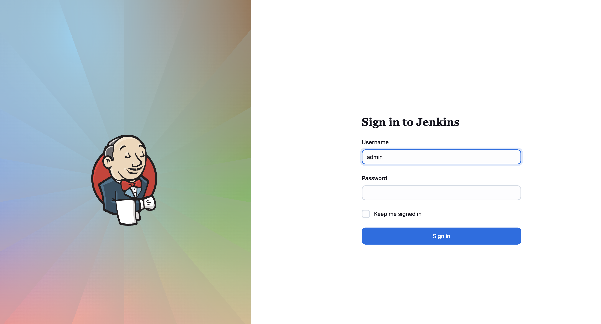
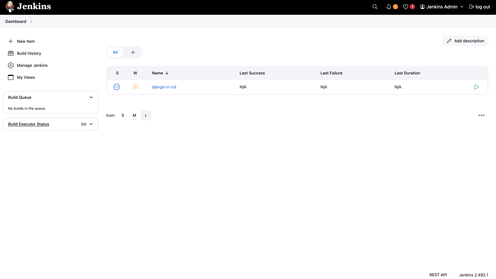
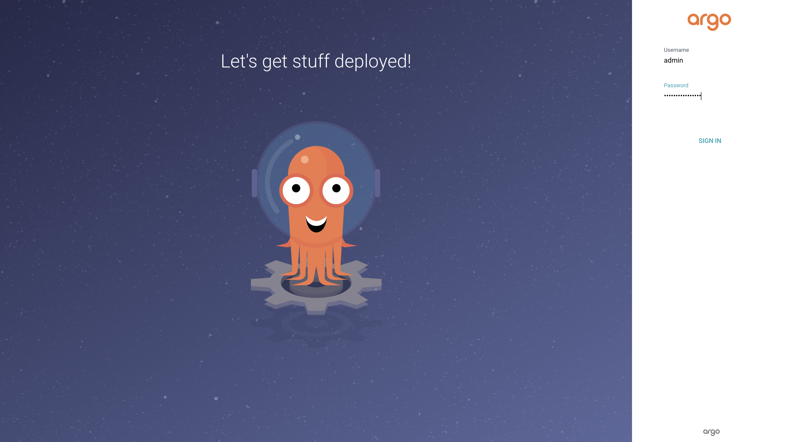
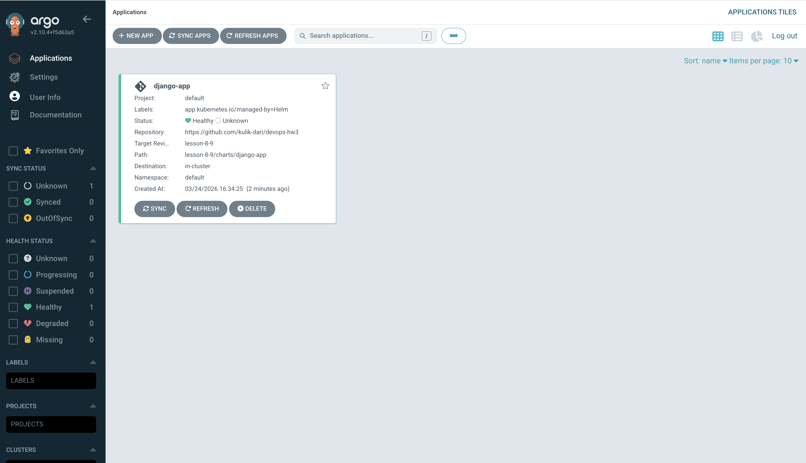

# Урок 8-9 — Jenkins + ArgoCD: Повний CI/CD Pipeline на AWS EKS

**Автор:** Дарія Куликова  
**Репозиторій:** https://github.com/kulik-dari/devops-hw3  
**Гілка:** `lesson-8-9`

---

## Результат виконання

| Компонент | Статус |
|-----------|--------|
| EKS Cluster | ✅ Розгорнуто |
| Jenkins (via Helm + Terraform) | ✅ Running |
| Jenkins Pipeline `django-ci-cd` | ✅ Створено через JCasC |
| ArgoCD (via Helm + Terraform) | ✅ Running |
| ArgoCD Application `django-app` | ✅ Healthy |
| Django Helm Chart | ✅ Synced |
| Terraform destroy | ✅ Виконано після перевірки |

---

## Архітектура CI/CD

```
┌─────────────┐    git push    ┌─────────────┐
│  Developer  │───────────────▶│   GitHub    │
└─────────────┘                └──────┬──────┘
                                      │ webhook / poll
                                      ▼
                               ┌─────────────┐
                               │   Jenkins   │  ← Helm + Terraform
                               │  (на EKS)   │  ← Kubernetes Agent
                               └──────┬──────┘
                                      │
                       ┌──────────────┼──────────────┐
                       ▼              ▼               ▼
                Build Docker    Push to ECR    Update values.yaml
                (Kaniko pod)    (AWS ECR)      + git push
                                                      │
                                               git change detected
                                                      ▼
                               ┌─────────────┐
                               │   ArgoCD    │  ← Helm + Terraform
                               │  (на EKS)   │  ← auto-sync
                               └──────┬──────┘
                                      │ синхронізація
                                      ▼
                               ┌─────────────┐
                               │  Django App │  ← Helm chart
                               │  Deployment │  ← HPA 2-6 pods
                               └─────────────┘
```

---

## Структура проєкту

```
lesson-8-9/
├── main.tf
├── backend.tf
├── outputs.tf
├── Jenkinsfile
├── README.md
├── screenshots/
│   ├── jenkins-login.png
│   ├── jenkins-dashboard.png
│   ├── argocd-login.png
│   └── argocd-app.png
├── modules/
│   ├── s3-backend/
│   ├── vpc/
│   ├── ecr/
│   ├── eks/              ← включає aws_ebs_csi_driver.tf
│   ├── jenkins/
│   └── argo_cd/
│       └── charts/       ← ArgoCD Application CR
└── charts/
    └── django-app/       ← watched by ArgoCD
        └── templates/
```

---

## Покрокове розгортання

### Передумови

```bash
brew install terraform awscli helm kubectl
aws configure
```

### Крок 1 — S3 Backend

```bash
cd lesson-8-9
terraform init
terraform apply -target=module.s3_backend
```

### Крок 2 — Remote backend

```bash
sed -i '' 's/# terraform {/terraform {/' backend.tf
sed -i '' 's/#   backend "s3" {/  backend "s3" {/' backend.tf
sed -i '' 's/#     bucket/    bucket/' backend.tf
sed -i '' 's/#     key/    key/' backend.tf
sed -i '' 's/#     region/    region/' backend.tf
sed -i '' 's/#     dynamodb_table/    dynamodb_table/' backend.tf
sed -i '' 's/#     encrypt/    encrypt/' backend.tf
sed -i '' 's/#   }/  }/' backend.tf
sed -i '' 's/# }/}/' backend.tf

terraform init -migrate-state
```

### Крок 3 — EKS + VPC + ECR

```bash
terraform apply -target=module.vpc -target=module.ecr -target=module.eks
# ~15 хвилин
aws eks update-kubeconfig --region us-west-2 --name lesson-8-eks
kubectl get nodes
```

### Крок 4 — EBS CSI Driver

```bash
helm repo add aws-ebs-csi-driver https://kubernetes-sigs.github.io/aws-ebs-csi-driver
helm repo update
helm upgrade --install aws-ebs-csi-driver aws-ebs-csi-driver/aws-ebs-csi-driver \
  --namespace kube-system
kubectl get pods -n kube-system | grep ebs
```

### Крок 5 — Jenkins + ArgoCD

```bash
terraform apply -target=module.jenkins
terraform apply -target=module.argo_cd
```

---

## Перевірка Jenkins

**URL:** `http://<JENKINS_EXTERNAL_IP>:8080`  
**Login:** `admin` / `admin123`

### Сторінка входу


### Dashboard — job django-ci-cd створено автоматично через JCasC


Pipeline виконує:
1. Збирає Django Docker образ через **Kaniko** (без Docker daemon)
2. Пушить в **ECR** з тегом `BUILD_NUMBER`
3. Оновлює `image.tag` в `charts/django-app/values.yaml`
4. Робить `git push` — ArgoCD підхоплює зміни автоматично

```bash
# Отримати URL Jenkins
kubectl get svc -n jenkins jenkins \
  -o jsonpath='{.status.loadBalancer.ingress[0].hostname}'
```

---

## Перевірка ArgoCD

**URL:** `http://<ARGOCD_EXTERNAL_IP>`  
**Login:** `admin` / `<initial-password>`

```bash
# Отримати URL
kubectl get svc -n argocd argocd-server \
  -o jsonpath='{.status.loadBalancer.ingress[0].hostname}'

# Отримати пароль
kubectl -n argocd get secret argocd-initial-admin-secret \
  -o jsonpath="{.data.password}" | base64 -d
```

### Сторінка входу ArgoCD


### Application django-app — статус Healthy ✅


```bash
# Перевірити через kubectl
kubectl get applications -n argocd
# NAME         SYNC STATUS   HEALTH STATUS
# django-app   Unknown       Healthy
```

ArgoCD стежить за гілкою `lesson-8-9`, шлях `lesson-8-9/charts/django-app`.  
Після кожного `git push` від Jenkins — автоматична синхронізація в кластері.

---

## Знищення інфраструктури

> ✅ Всі ресурси знищені після перевірки

```bash
# 1. Видалити Helm релізи
helm uninstall jenkins -n jenkins --ignore-not-found
helm uninstall argocd -n argocd --ignore-not-found

# 2. Terraform destroy
terraform destroy -lock=false

# 3. Видалити S3
python3 -c "
import boto3
s3 = boto3.resource('s3')
bucket = s3.Bucket('dariia-kulikova-tf-state-lesson8')
bucket.object_versions.delete()
bucket.delete()
print('S3 видалено!')
"

# 4. Видалити ECR
aws ecr delete-repository \
  --repository-name lesson-8-django \
  --region us-west-2 --force
```

---

## Вирішені проблеми

| Проблема | Рішення |
|----------|---------|
| Jenkins 2.440.2 — плагіни вимагають 2.479+ | Оновлено до `2.492.1-jdk21` |
| JCasC `jobs:` без job-dsl | Додано плагін `job-dsl:latest` |
| EBS PVC Pending | Встановлено `aws-ebs-csi-driver` через Helm |
| `controller.adminUser` deprecated | → `controller.admin.username` |
| `controller.tag` deprecated | → `controller.image.tag` |

---

## Вартість (~$9-10/день)

| Ресурс | Вартість |
|--------|----------|
| EKS Cluster | ~$2.4/день |
| 2× t3.medium | ~$2.0/день |
| 3× NAT Gateway | ~$3.2/день |
| LoadBalancers | ~$1.2/день |
